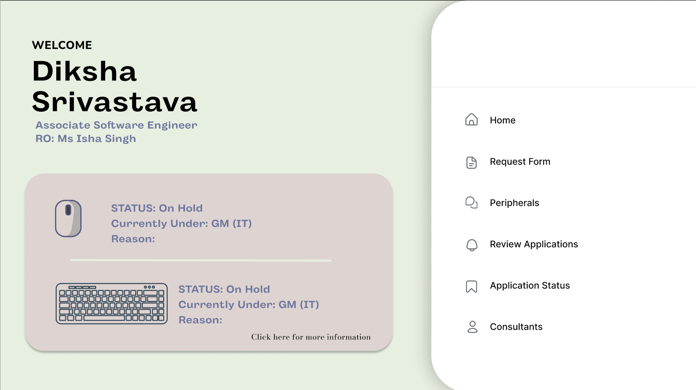
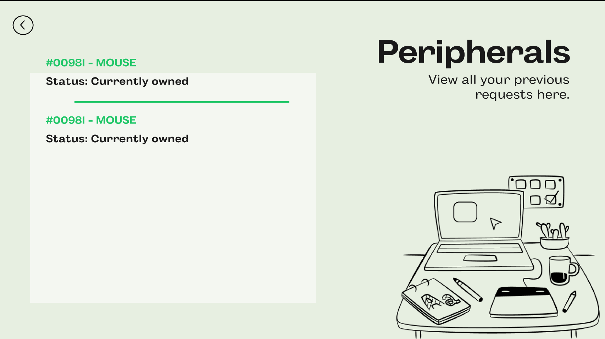
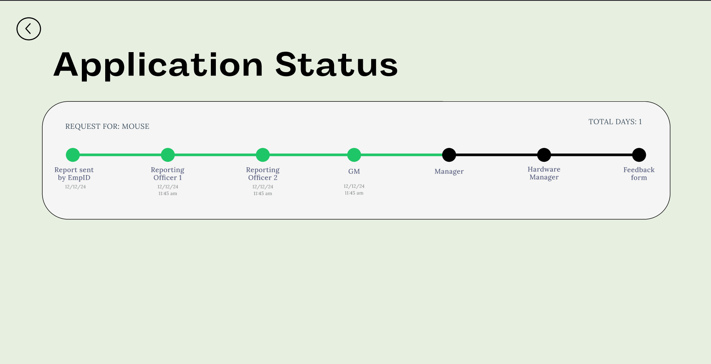
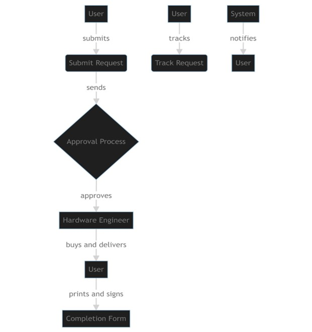
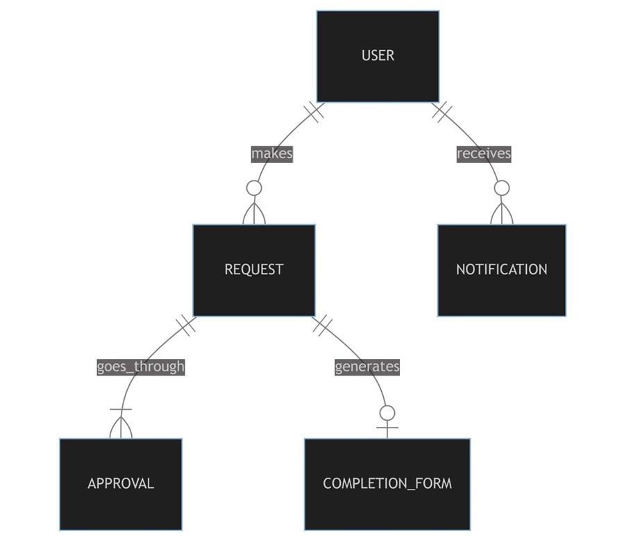
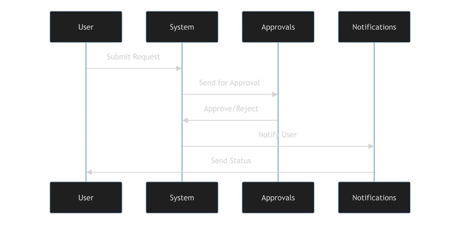

# Peripheral Request Management System

A digital system designed to streamline the process of requesting peripherals for employees. This application includes both a web and mobile interface and enables employees to submit requests, track their progress, and generate completion forms through a hierarchical approval system.

### Screenshots

#### 1. User Login

#### 2. Dashboard

#### 2. Peripheral Tracker

#### 3. Sequence Flow of the Request Approval

---

## Project Overview

The system allows users to:
- Submit requests for office peripherals.
- Track the status of their requests.
- Receive notifications about the approval process.
- Complete the process by printing and signing a completion form.

The application is built using:
- **Frontend**: Flutter (Mobile), HTML5 (Web)
- **Backend**: Django (REST API)
- **Database**: Firebase (for authentication), Custom SMTP (for email notifications)

## Table of Contents

- [Software Requirements Specification](#software-requirements-specification-srs)
- [Frontend Visualization](#frontend-visualization)
- [Entity-Relationship Diagrams](#entity-relationship-diagrams)
- [Sequence Diagrams](#sequence-diagrams)
- [Activity Diagrams](#activity-diagrams)
- [Technologies Used](#technologies-used)

## Software Requirements Specification (SRS)

### 1. Introduction

#### 1.1 Purpose
This project is designed to digitize the process of requesting peripherals for internal employees by providing a mobile and web application. The main purpose is to reduce manual efforts and streamline the approval process with real-time tracking and notifications.

#### 1.2 Scope
The application will offer:
- Submission of peripheral requests by employees.
- Hierarchical approval of requests.
- Real-time tracking and notifications on request status.
- Completion form generation for closed requests.

#### 1.3 Definitions, Acronyms, and Abbreviations
- **OTP**: One-Time Password
- **SMTP**: Simple Mail Transfer Protocol
- **API**: Application Programming Interface
- **ERD**: Entity-Relationship Diagram

#### 1.4 References
- Firebase Documentation
- Twilio API Documentation
- Django REST Framework Documentation

#### 1.5 Overview
This SRS covers the functionality of the application, providing diagrams and other artifacts to support the design.

### 2. Overall Description

#### 2.1 Product Perspective
This product replaces the manual request process with a mobile and web-based digital solution. The system is integrated with an authentication mechanism (Firebase) and notification services (SMTP and Twilio).

#### 2.2 Product Functions
- OTP-based authentication
- Request submission and approval tracking
- Notification system via email
- Printable completion form

#### 2.3 User Classes
- General Employees
- Reporting Officers
- Hardware Engineers
- Managers

#### 2.4 Design Constraints
- The web application is built using Django.
- The mobile app uses Flutter.

### 3. Specific Requirements

#### 3.1 Functional Requirements
- **Authentication**: Secure OTP-based authentication via Firebase and Twilio.
- **Request Tracking**: Allows users to track requests across different stages of approval.
- **Notifications**: Sends real-time email notifications for request updates.

### 4. Diagrams

#### 4.1 Use Case Diagram

#### 4.2 Entity-Relationship Diagram (ERD)

#### 4.3 Sequence Diagram

---

## Frontend Visualization

### Mobile Application (Flutter)
The mobile app allows users to:
- Submit new peripheral requests.
- Track existing requests.
- Receive real-time notifications regarding the status of their requests.

### Web Application
The web interface, developed with Django, provides a dashboard for employees to:
- View their submitted requests.
- Track their progress in the approval process.
- Generate a printable completion form.

## Technologies Used

- **Flutter**: For developing the mobile application.
- **Django**: For the backend API and web interface.
- **Firebase**: For authentication and request management.
- **Twilio**: For OTP-based login systems.
- **HTML5/CSS3/JavaScript**: For building the frontend of the web application.
- **SMTP**: For sending email notifications.
- **REST API**: For backend communication between the mobile and web clients.

## Conclusion

This project provides a streamlined and efficient method for employees to submit and track their peripheral requests. Through the use of both mobile and web interfaces, employees can easily manage their requests while administrators have full visibility of the approval process.

